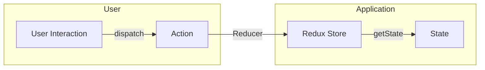

# react-redux-cheatsheet

It is *predictable* *state container* for *Javascript Apps*

1. It is for Javascript Apps.
1. It is a State container.
1. It is Predictable.


1. It is for Javascript Apps.
    - Redux is not tied to React
    - Can be used with React, Angular, Vue  or even Vanilla Javascript
    - Redux is library of Javascript applications

1. It is a State container.
    - Redux stores the state of your application
    - Consider a React app - state of a component
    - State of an app is the state represented by all the individual components of that app
    - Redux will store and manage the application state

1. It is Predictable.
    - Predictable in what way?
    - Redux is a state container
    - The state of the application can change
    - Ex: todo list app - item (pending) → item (completed)
    - In redux, all state transitions are explicit and it is possible to keep track of them
    - The changes to your application's state become predictable.

## Do we really have problem?

React context - Prevents prop drilling
useContext + useReducer ?
Redux 1.0 - August 2015

> React-Redux is the official Redux Ul binding library for React

1. React is a library used to build user interfaces
1. Redux is a library for managing state in a predictable way in JavaScript applications
1. React-redux is a library that provides bindings to use React and Redux together in an application

## Installation

```shell
$ npm install redux
```

## Core concepts

| Cake shop scenario | Redux | Purpose |
| -------- | -------- | -------- |
| Shop | Store | Holds the state of your application |
| Intention to BUY_CAKE | Action | Describes what happened |
| Shopkeeper | Reducer | Ties the store and actions
together |

- A **store** that holds the state of your application.
- An **action** that describes the changes in the state of the application.
- A **reducer** which actually carries out the state transition depending on the action.

### First Principle

- The state of your whole application is stored in an object tree within a single store

Maintain our application state in a single object which would be managed by the Redux store

**Cake Shop**:-
Let's assume we are tracking the number of cakes on the shelf

```json
{
    numberOfCakes: 10,
}
```

### Second Principle

- The only way to change the state is to emit an action, an object describing what happened

To update the state of your app, you need to let Redux know about that with an action.

*Not allowed to directly update the state object*

**Cake Shop**:-
Let the shopkeeper know about our action - BUY_CAKE
```json
{
    type: BUY_CAKE,
}
```

### Third Principle

- To specify how the state tree is transformed by actions, you write pure reducers

Reducer - (previousState, action) => newState

**Cake Shop**:-
Reducer is the shopkeeper
```jsx
const reducer = (state, action) =>{
  switch (action.type) {
    case BUY_CAKE: return {
      numOfCakes: state. numOfCakes - 1;
    }
  }
}
```

## Redux Cycle



#### Actions

- The only way your application can interact with the store
- Carry some information from your app to the redux store
- Plain JavaScript objects
- Have a `type` property that indicates the type of action being performed
- The `type` property is typically defined as string constants

1. An action is object with `type` property.
1. Action creator is a function returns an *action*.

```jsx
const BUY_CAKE = ' BUY_CAKE';

function buyCake() {
  return {
    type: BUY_CAKE,
    info: 'First redux action'
  }
}
```

#### Reducer

1. Specify how the app's state changes in response to actions sent to the store.
1. Function that accepts state and action as arguments, and returns the next state of the application.

> (previousState, action) => newstate   // reducer function have 2 arguments

```jsx
// REDUCER FUNCTION
const initialState = {
  numOfCakes: 10
}

const reducer = (state = initialState, action) => {
  switch(action.type) {
    case BUY_CAKE: return {
      ...state,
      numOfCakes: state. numOfCakes - 1
    }
    default: return state
  }
}
```

#### Redux Store

One store for the entire application
Responsibilities -
- Holds application state
- Allows access to state via `getState()`
- Allows state to be updated via `dispatch(action)`
- Registers listeners via `subscribe(listener)`
- Handles unregistering of listeners via the function returned by `subscribe(listener)`

```jsx
const redux = require('redux');
const createStore = redux.createStore
const store = createStore(reducer);
console.log('Initial state', store.getState()); // Initial state { numberOfCakes: 10 } 
const unsubscribe = store.subscribe(() => console.log('Updated state', store getState()))
store.dispatch(buyCake()) // Updated state { numberOfCakes: 9 } 
store.dispatch(buyCake()) // Updated state { numberOfCakes: 8 } 
store.dispatch(buyCake()) // Updated state { numberOfCakes: 7 } 
unsubscribe()

```
```console
// output
```

